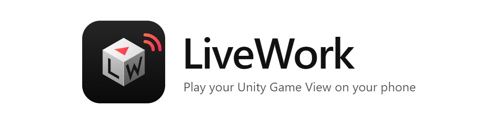
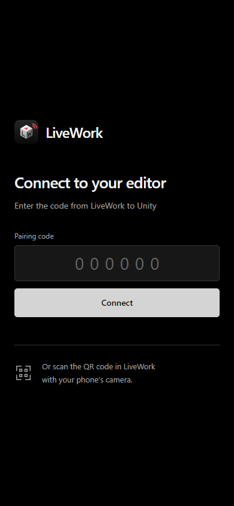
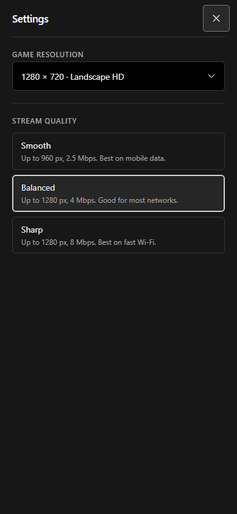

<p align="center">
  <picture>
    <source media="(prefers-color-scheme: dark)" srcset="docs/brand/banner-dark.png">
    
  </picture>
</p>

<p align="center">
  <a href="https://github.com/koezyrs/unity-livework/releases/latest"></a>
  
  
  <a href="https://github.com/koezyrs/unity-livework/releases/latest/download/LiveWork.apk"></a>
  <a href="LICENSE"></a>
</p>

<p align="center">
  <a href="README.md">English</a> · <b>Tiếng Việt</b>
</p>

**LiveWork** stream Game View của Unity Editor lên điện thoại hoặc trình duyệt
trên PC để bạn chơi trực tiếp. Thao tác chạm, chuột và bàn phím được gửi thẳng
về game. Không cần build, không cần cài game lên máy, không phải sửa script.

Sửa script, bấm Play, và thử ngay trên điện thoại thật chỉ sau vài giây.

<p align="center">
  
  &nbsp;&nbsp;
  
</p>

## Tính năng

- **Chơi game trong Editor từ điện thoại.** Hình và tiếng truyền qua WebRTC.
  Cảm ứng đa điểm, chuột và bàn phím được gửi về game.
- **App Android.** Quét mã QR là chơi toàn màn hình. App giữ màn hình luôn sáng
  và không bị camera che. Dùng trình duyệt cũng được.
- **Nút điều khiển giống Unity.** Play/Stop, Pause/Resume và Step ngay trên điện thoại.
- **Đổi độ phân giải thật của Game View.** Chọn sẵn hoặc tự nhập kích thước.
- **Chọn chất lượng stream.** Smooth cho 4G, Balanced hoặc Sharp.
- **Độ trễ thấp.** Mã hoá H.264 bằng GPU, không đệm video, và gửi thao tác tối
  đa một lần mỗi khung hình.
- **Kết nối nhanh.** Quét mã QR hoặc nhập mã 6 số.
- **Tự kết nối lại** sau khi tải lại trang, Play/Stop, đổi scene và compile script.
- **Cài bằng một Git URL.** Đã kèm sẵn Render Streaming (bản đã vá) và web service.

## Yêu cầu

| Thành phần | Hỗ trợ |
| --- | --- |
| Hệ điều hành máy host | Windows |
| Unity Editor | **6000.3.11f1** hoặc **6000.2.7f2** |
| Node.js | **22 trở lên**, có npm trong PATH |
| Git | Đã cài và Unity Package Manager dùng được |
| Mạng | Cùng mạng Wi-Fi hoặc Ethernet (LAN), [Tailscale](https://tailscale.com), hoặc [ZeroTier](https://www.zerotier.com) trên cả hai thiết bị, hoặc localhost trên máy host |
| Điện thoại | Android 8.0 trở lên (app hoặc Chrome), hoặc Chrome/Edge trên máy tính |
| Âm thanh | Scene có một AudioListener đang bật |
| Bàn phím/chuột | Active Input Handling là **Input System** hoặc **Both** |

Cài Node.js và Git trước khi chạy LiveWork. Chỉ cần cài Tailscale hoặc ZeroTier
nếu bạn dùng connection mode đó. Sau khi cài Node.js, khởi
động lại Unity để Unity nhận PATH mới.

## Bắt đầu nhanh

### 1. Cài package cho Unity

1. Mở **Window → Package Manager**.
2. Chọn **+ → Install package from git URL**.
3. Dán URL sau:

   ```text
   https://github.com/koezyrs/unity-livework.git?path=/packages/com.livework.unity#v0.2.0
   ```

4. Chờ Unity cài các package phụ thuộc và compile xong.

Bỏ `#v0.2.0` nếu muốn luôn lấy code mới nhất từ nhánh `main`.

### 2. Cài app Android (không bắt buộc)

1. Trên điện thoại, mở
   [bản release mới nhất](https://github.com/koezyrs/unity-livework/releases/latest)
   và tải file **LiveWork.apk**.
2. Mở file vừa tải. Khi Android hỏi, cho phép trình duyệt cài ứng dụng không rõ nguồn gốc.
3. Bấm **Cài đặt**.

Không cần cáp USB hay bật chế độ nhà phát triển. Bạn cũng có thể dùng Chrome thay cho app.

### 3. Kết nối

1. Mở scene của bạn, vào **Window → LiveWork**.
2. Chọn **Connection Mode**: **LAN**, **Tailscale** hoặc **ZeroTier**.
3. Bấm **Start server**. Lần đầu chạy, LiveWork sẽ tải các thư viện cần thiết bằng npm.
4. Chọn **QRCode** là **Android** nếu dùng app, hoặc **Web** nếu dùng trình duyệt.
5. Quét mã QR bằng điện thoại.
6. Bấm **Play** trên thanh công cụ, rồi chạm vào game.

Nếu dùng điện thoại, cả hai thiết bị phải cùng mạng của connection mode đã chọn.
Địa chỉ `127.0.0.1` chỉ dùng được trên chính máy host.

### Connection mode

| Mode | Khi nào dùng | Service nhận kết nối từ |
| --- | --- | --- |
| **LAN** | Điện thoại và máy host cùng mạng Wi-Fi hoặc Ethernet | Subnet LAN của máy host, ví dụ `192.168.1.0/24` |
| **Tailscale** | Mọi mạng, qua mạng riêng miễn phí [Tailscale](https://tailscale.com) | `100.64.0.0/10` và `fd7a:115c:a1e0::/48` |
| **ZeroTier** | Mọi mạng, qua mạng riêng miễn phí [ZeroTier](https://www.zerotier.com) | Subnet mạng ZeroTier của máy host |

Service luôn nhận kết nối từ localhost. Chỉ đổi được mode khi server đã dừng:
bấm **End server** trước. Mode LAN chọn card mạng có default gateway, nên bỏ qua
các card ảo (Hyper-V, VirtualBox, WSL).

## Cách dùng

### Cửa sổ LiveWork trong Unity

| Nút | Chức năng |
| --- | --- |
| Address · Copy | Sao chép địa chỉ |
| Address · Open | Mở địa chỉ trong trình duyệt của máy host |
| Pairing code | Mã 6 số để nhập trên thiết bị |
| Connection Mode | **LAN**, **Tailscale** hoặc **ZeroTier**. Bị khóa khi server đang chạy |
| QRCode | **Web**: mã QR mở trình duyệt. **Android**: mã QR mở app LiveWork |
| Start server / End server | Bật hoặc tắt service LiveWork của project này |

Mỗi lần bật server sẽ có mã kết nối mới. Khi tắt server, LiveWork trả lại cài
đặt Game View và run-in-background như trước. Play Mode không bị thay đổi.

### Thanh công cụ trên thiết bị

| Nút | Chức năng |
| --- | --- |
| Play / Stop | Vào hoặc thoát Play Mode |
| Pause / Resume | Tạm dừng hoặc chạy tiếp game |
| Step | Chạy thêm một khung hình khi đang tạm dừng |
| Sound | Bật hoặc tắt tiếng (mặc định tắt) |
| Fullscreen | Chỉ hiện game |
| ☰ Settings | Độ phân giải game và chất lượng stream |
| Chuột phải vào game | Khoá con trỏ chuột (trình duyệt máy tính) |

**Game resolution** đổi kích thước thật của Game View, không chỉ đổi hình trên
thiết bị. Mỗi cạnh phải là số chẵn, từ 240 đến 1920, và tổng số điểm ảnh không
quá 2.073.600.

**Stream quality:**

| Lựa chọn | Kích thước tối đa | Bitrate tối đa | Phù hợp với |
| --- | --- | --- | --- |
| Smooth | 960 px | 2,5 Mbps | 4G |
| Balanced (mặc định) | 1280 px | 4 Mbps | Đa số mạng |
| Sharp | 1280 px | 8 Mbps | Wi-Fi nhanh |

### Hỗ trợ thao tác nhập

| Active Input Handling | Thao tác được hỗ trợ |
| --- | --- |
| Input System | Cảm ứng đa điểm, chuột, cuộn, bàn phím, khoá con trỏ |
| Input Manager (Old) | Chỉ cảm ứng |
| Both | Thao tác của Input System và cảm ứng kiểu cũ |

LiveWork không thay đổi cài đặt input, action map, input module hay script của game.

## Mẹo cải thiện hiệu năng

- **Kiểm tra đường truyền Tailscale.** Chạy `tailscale ping <tên-điện-thoại>`
  trên máy host. Nếu thấy `via DERP` nghĩa là dữ liệu đi vòng qua máy chủ trung
  gian và bị trễ thêm. Kết nối `direct` nhanh hơn nhiều. Nếu mạng 4G chặn, hãy mở
  cổng UDP 41641 trên tường lửa của máy host hoặc thử mạng khác.
- **Dùng Smooth khi đi 4G.** Bitrate thấp giúp tránh mất gói tin, nguyên nhân
  gây giật hình và chạm bị trễ.
- **Không để Unity chạy chậm khi ở nền.** Vào **Edit → Preferences → General**,
  đặt **Interaction Mode** là **No Throttling**.
- **Nên dùng GPU NVIDIA.** Unity mã hoá H.264 bằng GPU NVIDIA. Máy khác sẽ mã hoá
  bằng CPU, chậm hơn.

## Mạng và bảo mật

- Mỗi project chạy một service riêng trên một cổng trống. Hãy copy địa chỉ từ
  cửa sổ LiveWork.
- Service chỉ nhận kết nối từ localhost và mạng của connection mode đã chọn, và
  bắt buộc phải nhập mã trước khi điều khiển hay xem hình. Ở mode LAN, ai cùng
  Wi-Fi cũng mở được trang, nên chỉ dùng LAN trên mạng bạn tin tưởng.
- Hình ảnh và thao tác đi thẳng giữa hai thiết bị. LiveWork không dùng máy chủ
  STUN hay TURN công cộng.
- App Android và trang web dùng HTTP thường trong mạng riêng của bạn. Không dùng
  mode LAN trên Wi-Fi công cộng, và không mở service ra internet công cộng.
- File `Library/LiveWork/host.json` chứa thông tin đăng nhập cục bộ. Không commit file này.

## Xử lý lỗi

| Vấn đề | Cách kiểm tra |
| --- | --- |
| Start server bị lỗi | Cài Node.js 22+ kèm npm, khởi động lại Unity và đọc lỗi trong cửa sổ |
| Lần chạy đầu bị lỗi | Kiểm tra kết nối npm và cài đặt proxy, rồi thử lại |
| Điện thoại không mở được địa chỉ | Kết nối cả hai thiết bị vào mạng của connection mode đã chọn. Không dùng `127.0.0.1` trên điện thoại |
| "No LAN network found" hoặc "ZeroTier is not connected" | Kết nối máy host vào mạng đó, hoặc chọn connection mode khác |
| "Another browser may be controlling Unity" | Đóng tab hoặc app khác đang kết nối, rồi kết nối lại |
| Mã kết nối bị từ chối | Dùng mã hiện tại. Bật lại server sẽ đổi mã |
| Trùng assembly Render Streaming | Gỡ package `com.unity.renderstreaming` cài riêng |
| Game không nhận bàn phím hoặc chuột | Dùng Input System hoặc Both, và kiểm tra binding |
| Không có tiếng | Kiểm tra AudioListener, rồi bấm nút âm thanh |
| Bấm Play không chạy | Sửa lỗi compile trong Unity Console |
| Hình bị giật hoặc trễ | Xem [Mẹo cải thiện hiệu năng](#mẹo-cải-thiện-hiệu-năng) |
| Không cài đè được lên app cũ | Gỡ app cũ trước, vì app cũ được ký bằng khoá khác |

## Giới hạn

- Đây là bản preview. Chỉ hỗ trợ các phiên bản Unity liệt kê ở trên.
- Stream tối đa 30 FPS.
- Game chạy trên máy host. LiveWork không kiểm tra được hiệu năng trên thiết bị,
  native plugin hay hành vi của bản build Android.
- Giữ máy host không ngủ và Unity không bị thu nhỏ. Máy ngủ, khoá màn hình hoặc
  thu nhỏ Editor sẽ làm dừng stream.
- Chưa hỗ trợ: máy host macOS và Linux, app iOS, tay cầm, cảm biến, bàn phím ảo
  và nhiều người điều khiển cùng lúc.

## Phát triển

```powershell
.\scripts\setup.ps1
cd service
npm test              # test service
npm run test:ui       # test giao diện web bằng Playwright và Microsoft Edge
npm run check:bundle  # kiểm tra bundle đã commit trong package
npm run build         # tạo lại Service~ và runtime đi kèm
npm run brand         # tạo lại toàn bộ file logo và icon
```

Cách build app Android: xem [android/README.md](android/README.md).
Cách test với Unity thật: xem [docs/TESTING.md](docs/TESTING.md).

| Thư mục | Nội dung |
| --- | --- |
| `packages/com.livework.unity` | Package cho Unity |
| `service` | Node service, web client, script đóng gói và test |
| `android` | App Android |
| `sample` | Project Unity mẫu và dữ liệu test |
| `vendor` | Mã nguồn Render Streaming đã ghim phiên bản và các bản vá |
| `docs` | Giao thức, ghi chú test và file thương hiệu |

### Nhánh

LiveWork dùng Git Flow:

| Nhánh | Tạo từ | Merge vào | Mục đích |
| --- | --- | --- | --- |
| `main` | — | — | Code đã phát hành. Mỗi bản phát hành có tag `vX.Y.Z` |
| `develop` | `main` | — | Code đã tích hợp cho bản phát hành tiếp theo |
| `feature/<tên>` | `develop` | `develop` | Một tính năng hoặc thay đổi mới |
| `release/<phiên-bản>` | `develop` | `main` và `develop` | Chuẩn bị phát hành |
| `hotfix/<phiên-bản>` | `main` | `main` và `develop` | Sửa lỗi gấp cho bản đã phát hành |

Khi báo lỗi, hãy ghi rõ phiên bản Unity, thiết bị và phiên bản trình duyệt hoặc
app, input backend, các bước tái hiện lỗi và log. Xoá mã kết nối và token khỏi log.

## Giấy phép

LiveWork phát hành theo [giấy phép MIT](LICENSE).

Phần mã Unity Render Streaming đi kèm dùng
[Unity Companion License](packages/com.livework.unity/ThirdParty/RenderStreaming/LICENSE.md).
Xem [Third Party Notices](packages/com.livework.unity/Third%20Party%20Notices.md)
để biết toàn bộ thành phần bên thứ ba.

Unity là thương hiệu của Unity Technologies. LiveWork không liên kết và không
được Unity Technologies bảo trợ.
